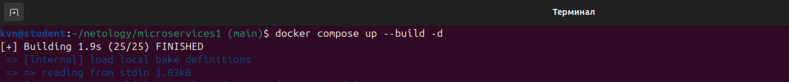
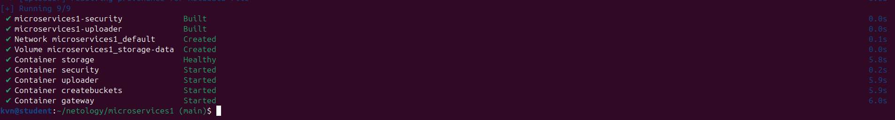
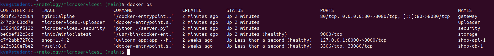
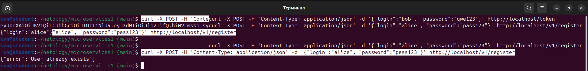
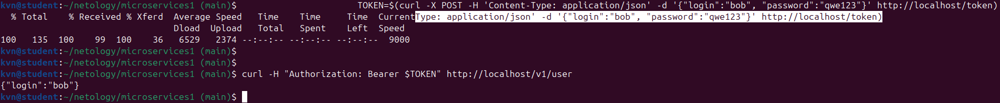
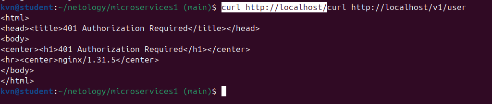
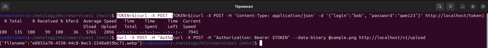
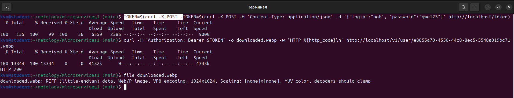
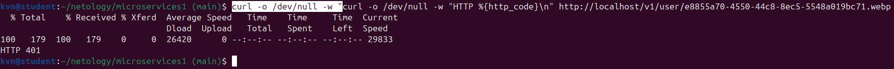
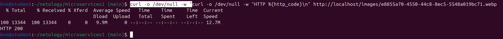

# Домашнее задание. «Микросервисы: принципы»

Предложения по инфраструктуре микросервисной системы: API Gateway, брокер сообщений и практическая реализация API Gateway на NGINX + docker-compose.

---

## Задача 1: API Gateway

Требования к решению:

- маршрутизация запросов к нужному сервису на основе конфигурации;
- возможность проверки аутентификационной информации в запросах;
- терминация HTTPS.

### Сравнительная таблица

| Решение | Маршрутизация по конфигурации | Проверка аутентификации | Терминация HTTPS | Балансировка | Особенности |
|---|---|---|---|---|---|
| **NGINX** | Да, декларативный конфиг (location, upstream) | Да, через `auth_request` | Да (`ssl_certificate`) | Да (round-robin, least_conn) | Высокая производительность, минимум зависимостей, единый инструмент для маршрутизации и раздачи статики; сложнее расширять логику |
| **Kong** | Да (YAML/DB, admin-API) | Да, плагины (JWT, OAuth2, LDAP) | Да | Да | Богатая экосистема плагинов, метрики; требует БД (или DB-less режим), ресурсоёмкий |
| **HAProxy** | Да (конфиг-файл, ACL) | Частично — авторизация через ACL/Lua | Да | Да (активные health-check) | Очень высокая скорость L4/L7; нет готовых REST-плагинов, конфиг менее читаем |
| **Traefik** | Да (автообнаружение Docker/K8s) | Да (JWT middleware, forward-auth) | Да (автономный Let's Encrypt) | Да (round-robin) | Автообнаружение сервисов, динамический конфиг; меньше ручного контроля |
| **KrakenD** | Да (JSON/YAML) | Да (JWT-валидация, forward-auth) | Да | Да | Высокая скорость (Go), stateless; меньше готовых корпоративных функций |
| **Apache APISIX** | Да (etcd, admin-API) | Да (JWT, key-auth и др. плагины) | Да | Да | Богатый набор плагинов; требует etcd, сложнее в эксплуатации |

### Выбор: NGINX

Обоснование:

1. Маршрутизация настраивается декларативным конфигом (`location`, `upstream`) и версионируется в git.
2. Проверка аутентификации через `auth_request`: перед маршрутом выполняется подзапрос к сервису аутентификации, запрос пропускается только при ответе 2xx (реализовано в задаче 3).
3. Штатная поддержка SSL/TLS для терминации HTTPS.
4. Не требует внешних зависимостей (БД, etcd) и потребляет мало ресурсов.

---

## Задача 2: Брокер сообщений

Требования к решению:

- поддержка кластеризации для надёжности;
- хранение сообщений на диске в процессе доставки;
- высокая скорость работы;
- поддержка различных форматов сообщений;
- разделение прав доступа к разным потокам сообщений;
- простота эксплуатации.

### Сравнительная таблица

| Решение | Кластеризация | Хранение на диске | Скорость | Форматы сообщений | Разграничение прав | Простота эксплуатации |
|---|---|---|---|---|---|---|
| **RabbitMQ** | Да, зеркалирование/кворумные очереди | Да, durable-очереди и persistent-сообщения | Высокая (десятки–сотни тыс. msg/s) | Любые (JSON, protobuf, Avro…) | Да, пользователи, vhosts, permissions | Высокая: готовый образ, UI-консоль |
| **Apache Kafka** | Да, партиции + реплики | Да, сегментированный commit-log | Очень высокая (миллионы msg/s) | Любые байтовые | Да, ACL по топикам/группам | Средняя: брокеры, KRaft/ZooKeeper, тюнинг, нет UI |
| **ActiveMQ (Classic/Artemis)** | Да (master/slave, Artemis-кластер) | Да (KahaDB/Journal) | Средняя | Любые + JMS-типы | Да (JAAS) | Средняя: Java-стек, настройка громоздкая |
| **Redis (Streams/Pub-Sub)** | Да (Sentinel/Cluster) | Streams — да, Pub/Sub — нет | Очень высокая | Любые байтовые | Да (ACL с Redis 6) | Высокая, но Pub/Sub не хранит сообщения |
| **NATS + JetStream** | Да | Да (JetStream) | Очень высокая | Любые байтовые | Да (accounts) | Высокая: один бинарник, простая настройка; JetStream моложе конкурентов |

### Выбор: RabbitMQ

Обоснование по требованиям:

1. Кластеризация — кворумные (Raft) и зеркалируемые очереди, отказ узла не останавливает доставку.
2. Хранение на диске — durable-очереди с persistent-сообщениями переживают рестарт брокера.
3. Скорость — достаточна для типовых интеграционных нагрузок (десятки тысяч сообщений/с).
4. Форматы — передаёт любые данные без изменений (JSON, protobuf, Avro, бинарные файлы).
5. Права доступа — пользователи, vhosts и permissions на exchange/queue разводят потоки разных сервисов.
6. Эксплуатация — один docker-образ, встроенная веб-консоль, метрики Prometheus-плагином.

Kafka быстрее, но заметно сложнее в эксплуатации (кластер брокеров, KRaft, мониторинг лагов) — для этой задачи избыточен.

---

## Задача 3: API Gateway (NGINX + docker-compose)

### Архитектура

```
client -> gateway (nginx:8080) --+--> security:3000  (регистрация, логин, проверка токена, /v1/user)
                                  +--> uploader:3000  (POST /v1/upload)
                                  +--> storage:9000   (minio, S3, бакет images)
```

### Файлы решения

- `docker-compose.yaml` — стек из 5 сервисов;
- `gateway/nginx.conf` — конфиг API Gateway;
- `security/src/server.py` — сервис аутентификации;
- `uploader/src/server.js`, `uploader/*`, `security/*` — сервисы из репозитория курса;
- `screenshots/` — полный лог проверки.

### docker-compose.yaml

Полный файл конфигурации стека — [docker-compose.yaml](./docker-compose.yaml).

### gateway/nginx.conf

Полный конфиг настройки шлюза — [gateway/nginx.conf](./gateway/nginx.conf).

### Маршруты

| Маршрут | Доступ | Куда направляется |
|---|---|---|
| POST `/v1/register` | анонимный | security `POST /v1/user` |
| POST `/v1/token` | анонимный | security `POST /v1/token` |
| GET `/v1/user` | по токену (`auth_request`) | security `GET /v1/user` |
| POST `/v1/upload` | по токену (`auth_request`) | uploader `POST /v1/upload` |
| GET `/v1/user/{image}` | по токену (`auth_request`) | minio `GET /images/{image}` |
| `/token`, `/upload`, `/images/{image}` | алиасы | те же сервисы — чтобы дословно работали curl-команды из раздела «Ожидаемый результат» |

Проверка токена выполняется внутренним подзапросом `/_auth` → security `GET /v1/token/validation`: при ответе 2xx запрос пропускается дальше, при 401 — клиент получает 401.

### Доработки исходных сервисов

1. В `security/src/server.py` добавлены отсутствующие эндпоинты: `POST /v1/user` (регистрация), `GET /v1/user` (информация о пользователе по JWT).
2. `GET /v1/token/validation` для некорректного токена возвращает **401**, а не 200 с текстом ошибки — иначе `auth_request` посчитает токен валидным.
3. В `security/requirements.txt` зафиксированы версии зависимостей Flask 1.1.1 (Werkzeug, Jinja2 и др.) — с актуальными версиями образ из курса не запускается.

### Запуск и проверка

Ход выполнения практической части (задача 3). Ниже приведены скриншоты с подписями по шагам — от сборки стека до проверки ограничений доступа.

#### 1. Сборка и запуск стека

Команда `docker compose up --build -d` — сборка образов и запуск всех сервисов.



Сборка завершена успешно (`[+] Running 9/9`): сеть, volume, контейнеры `security`, `uploader`, `storage`, `createbuckets`, `gateway` созданы и запущены, `storage` — `Healthy`.



#### 2. Проверка статуса контейнеров

`docker ps` — все контейнеры запущены: `gateway` (nginx), `uploader`, `security`, `storage` (minio), `shop-api-1`, `shop-db-1`.



#### 3. Регистрация пользователя и получение токена

- `POST /v1/register` — регистрация нового пользователя; повторная регистрация того же пользователя возвращает `{"error": "User already exists"}`.
- `POST /v1/token` — для существующего пользователя (`bob`) возвращается JWT.



#### 4. Проверка токена и доступ к данным пользователя

Токен сохраняется в переменную, затем `GET /v1/user` с заголовком `Authorization: Bearer $TOKEN` возвращает данные пользователя.



Запрос `GET /v1/user` **без** токена отклоняется шлюзом — возвращается `401 Authorization Required`.



#### 5. Загрузка файла

`POST /v1/upload` с `Authorization: Bearer $TOKEN` и бинарными данными файла — сервис сжимает картинку (PNG → WebP) и возвращает имя файла.



#### 6. Получение файла

- `GET /v1/user/{image}` с токеном — файл скачивается (`HTTP 200`), тип `Web/P image` подтверждён командой `file`.
- `GET /v1/user/{image}` **без** токена — `HTTP 401`.
- `GET /images/{image}` — файл отдаётся напрямую из `minio` (`HTTP 200`).








